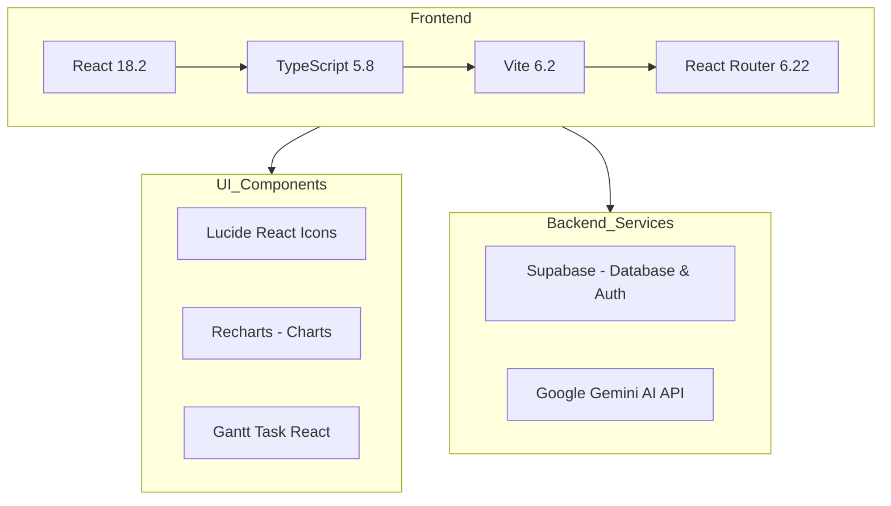
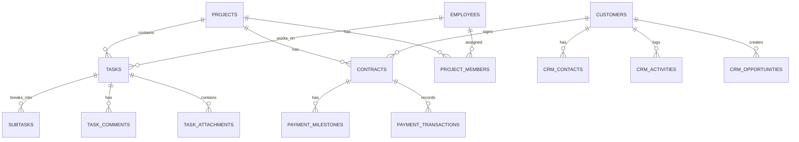

# TÀI LIỆU ĐẶC TẢ KỸ THUẬT
## Hệ thống Quản lý Doanh nghiệp CIC.TTB.ERP

---

**Phiên bản:** 1.0  
**Ngày cập nhật:** 04/01/2026  
**Đơn vị phát triển:** CIC

---

## MỤC LỤC

1. [Tổng quan hệ thống](#1-tổng-quan-hệ-thống)
2. [Kiến trúc kỹ thuật](#2-kiến-trúc-kỹ-thuật)
3. [Các module chức năng](#3-các-module-chức-năng)
4. [Mô hình dữ liệu](#4-mô-hình-dữ-liệu)
5. [Tích hợp và API](#5-tích-hợp-và-api)
6. [Yêu cầu hệ thống](#6-yêu-cầu-hệ-thống)

---

## 1. TỔNG QUAN HỆ THỐNG

### 1.1 Giới thiệu

**CIC.TTB.ERP** là hệ thống Quản lý Doanh nghiệp tích hợp (Enterprise Resource Planning) được thiết kế dành riêng cho các doanh nghiệp hoạt động trong lĩnh vực xây dựng, tư vấn thiết kế và BIM (Building Information Modeling).

### 1.2 Mục tiêu

| Mục tiêu | Mô tả |
|----------|-------|
| **Quản lý dự án** | Theo dõi tiến độ, ngân sách, nhân sự trên từng dự án |
| **Quản lý hợp đồng** | Quản lý hợp đồng, các mốc thanh toán và dòng tiền |
| **Quản lý nhân sự** | Thông tin nhân viên, chấm công, đánh giá hiệu suất |
| **Quản lý khách hàng** | CRM tích hợp với hoạt động theo dõi khách hàng |
| **Tích hợp AI** | Trợ lý AI hỗ trợ truy vấn thông tin và quy trình |
| **Xem mô hình BIM** | Hiển thị mô hình 3D dự án xây dựng |

### 1.3 Đối tượng sử dụng

- **Giám đốc/Lãnh đạo**: Xem tổng quan doanh nghiệp, báo cáo tổng hợp
- **Quản lý dự án**: Quản lý tiến độ, phân công nhiệm vụ, theo dõi RACI
- **Nhân viên**: Quản lý công việc cá nhân, yêu cầu nghỉ phép
- **Kế toán**: Theo dõi hợp đồng, thanh toán, dòng tiền
- **Admin**: Quản lý người dùng, cấu hình hệ thống

---

## 2. KIẾN TRÚC KỸ THUẬT

### 2.1 Công nghệ sử dụng



### 2.2 Tech Stack

| Thành phần | Công nghệ | Phiên bản |
|------------|-----------|-----------|
| **Framework** | React | 18.2 |
| **Ngôn ngữ** | TypeScript | 5.8.2 |
| **Build Tool** | Vite | 6.2 |
| **Routing** | React Router DOM | 6.22.3 |
| **Database** | Supabase (PostgreSQL) | 2.89 |
| **Icons** | Lucide React | 0.358 |
| **Charts** | Recharts | 2.12.3 |
| **Gantt Chart** | gantt-task-react | 0.3.9 |

### 2.3 Cấu trúc thư mục

```
CIC.TTB.ERP/
├── components/          # Các component tái sử dụng
│   ├── AIChatAssistant.tsx
│   ├── BIMModelViewer.tsx
│   ├── ProjectCreationWizard.tsx
│   ├── ProjectGantt.tsx
│   ├── ProjectKanban.tsx
│   ├── TaskModal.tsx
│   └── ...
├── pages/               # Các trang chính
│   ├── Dashboard.tsx
│   ├── ProjectList.tsx
│   ├── ContractList.tsx
│   ├── HRMList.tsx
│   ├── CRMList.tsx
│   └── ...
├── services/            # Lớp service gọi API
│   ├── AIService.ts
│   ├── GeminiService.ts
│   ├── project.service.ts
│   ├── contract.service.ts
│   └── ...
├── contexts/            # React Context
├── database/            # Schema và migrations
├── types/               # TypeScript definitions
└── utils/               # Tiện ích
```

---

## 3. CÁC MODULE CHỨC NĂNG

### 3.1 Module Dashboard (Bảng điều khiển)

**File:** `pages/Dashboard.tsx`

#### 3.1.1 Mô tả
Bảng điều khiển tổng quan cung cấp cái nhìn toàn cảnh về hoạt động doanh nghiệp thông qua các biểu đồ và KPI.

#### 3.1.2 Tính năng

| Tính năng | Mô tả |
|-----------|-------|
| **KPI Cards** | Hiển thị tổng doanh thu, số dự án, tiến độ trung bình |
| **Biểu đồ doanh thu** | Area Chart thể hiện doanh thu theo thời gian |
| **Biểu đồ dự án** | Pie Chart phân loại dự án theo trạng thái |
| **Biểu đồ ngân sách** | Bar Chart so sánh ngân sách vs chi tiêu |

#### 3.1.3 Dữ liệu hiển thị

```typescript
interface DashboardSummary {
  totalRevenue: number;
  totalProjects: number;
  averageProgress: number;
  projectsByStatus: ProjectStatus[];
}
```

---

### 3.2 Module Quản lý Dự án (Project Management)

**Files:** `pages/ProjectList.tsx`, `pages/ProjectDetail.tsx`

#### 3.2.1 Mô tả
Module quản lý toàn bộ vòng đời dự án từ khởi tạo đến hoàn thành, bao gồm phân công nhân sự, theo dõi tiến độ và quản lý chất lượng.

#### 3.2.2 Tính năng chính

| Tính năng | Mô tả |
|-----------|-------|
| **Danh sách dự án** | Hiển thị dạng Grid/List với bộ lọc đa tiêu chí |
| **Chi tiết dự án** | Xem thông tin đầy đủ với nhiều tab |
| **Tạo dự án** | Wizard hướng dẫn tạo dự án từng bước |
| **Import/Export** | Nhập từ Excel, đồng bộ Google Sheets |
| **RACI Matrix** | Ma trận phân công trách nhiệm |

#### 3.2.3 Trạng thái dự án

```typescript
enum ProjectStatus {
  PLANNING = 'Lập kế hoạch',
  IN_PROGRESS = 'Đang thực hiện',
  DELAYED = 'Tạm hoãn',
  COMPLETED = 'Hoàn thành'
}
```

#### 3.2.4 Thông tin dự án

```typescript
interface Project {
  id: string;
  code: string;
  name: string;
  client: string;
  location: string;
  manager: string;
  
  // Thông tin kỹ thuật (Theo Luật 58/2024/QH15)
  projectGroup?: string;      // Nhóm A, B, C
  constructionType?: string;  // Dân dụng, Công nghiệp
  constructionLevel?: string; // Cấp I, II, III, IV
  scale?: string;             // Quy mô
  
  capitalSource: 'StateBudget' | 'NonStateBudget';
  status: ProjectStatus;
  progress: number;
  budget: number;
  spent: number;
  deadline: string;
}
```

#### 3.2.5 Các tab chi tiết dự án

| Tab | Component | Mô tả |
|-----|-----------|-------|
| **Thông tin** | `ProjectInfoTab` | Thông tin chung, cấp công trình |
| **Kế hoạch** | `ProjectPlanTab` | Timeline, milestones |
| **Nhân lực** | `ProjectPersonnelTab` | Đội dự án, RACI |
| **Tài liệu** | `ProjectDocuments` | Quản lý hồ sơ |
| **Kanban** | `ProjectKanban` | Quản lý task theo cột |
| **Gantt** | `ProjectGantt` | Biểu đồ tiến độ |
| **BIM** | `BIMModelViewer` | Xem mô hình 3D |

---

### 3.3 Module Quản lý Công việc (Task Management)

**Files:** `pages/TaskList.tsx`, `components/TaskModal.tsx`

#### 3.3.1 Mô tả
Quản lý công việc chi tiết theo quy trình ISO, với các trạng thái phù hợp với quy trình nội bộ doanh nghiệp.

#### 3.3.2 Trạng thái công việc

```typescript
enum TaskStatus {
  OPEN = 'Mở',
  PENDING = 'Đang chờ',
  S0 = 'S0 Đang thực hiện',
  S1 = 'S1 Phối hợp',
  S3 = 'S3 Duyệt nội bộ',
  S4 = 'S4 Lãnh đạo duyệt',
  S4_1 = 'S4.1 Sửa theo LĐ',
  S5 = 'S5 Đã duyệt',
  S6 = 'S6 Trình khách hàng',
  S6_1 = 'S6.1 Sửa theo KH',
  COMPLETED = 'Hoàn thành'
}
```

#### 3.3.3 Độ ưu tiên

```typescript
enum TaskPriority {
  CRITICAL = 'Khẩn cấp',
  HIGH = 'Cao',
  MEDIUM = 'Trung bình',
  LOW = 'Thấp'
}
```

#### 3.3.4 Cấu trúc Task

```typescript
interface Task {
  id: string;
  code: string;           // [GiaiDoan].[Loai].[BoMon].[STT]
  name: string;
  projectId: string;
  assignee: {
    id: string;
    name: string;
    avatar: string;
    role: string;
  };
  reviewer?: string;      // Người kiểm tra
  status: TaskStatus;
  priority: TaskPriority;
  startDate: string;
  dueDate: string;
  progress: number;
  subtasks?: SubTask[];
  comments?: TaskComment[];
  attachments?: TaskAttachment[];
}
```

---

### 3.4 Module Quản lý Hợp đồng (Contract Management)

**File:** `pages/ContractList.tsx`

#### 3.4.1 Mô tả
Quản lý toàn bộ thông tin hợp đồng, các mốc thanh toán, theo dõi dòng tiền và xuất hóa đơn.

#### 3.4.2 Tính năng

| Tính năng | Mô tả |
|-----------|-------|
| **Danh sách hợp đồng** | Hiển thị với filter theo trạng thái |
| **Chi tiết hợp đồng** | Modal xem đầy đủ thông tin |
| **Mốc thanh toán** | Quản lý các đợt thanh toán |
| **Giao dịch** | Ghi nhận từng giao dịch thực tế |
| **Biểu đồ dòng tiền** | Cash Flow Chart |

#### 3.4.3 Trạng thái hợp đồng

```typescript
enum ContractStatus {
  DRAFT = 'Nháp',
  ACTIVE = 'Hiệu lực',
  PENDING_PAYMENT = 'Chờ thanh toán',
  COMPLETED = 'Hoàn thành',
  OVERDUE = 'Quá hạn'
}
```

#### 3.4.4 Cấu trúc hợp đồng

```typescript
interface Contract {
  id: string;
  code: string;
  projectId?: string;
  signedDate: string;
  
  // Bên A
  sideAName: string;
  sideARep: string;
  sideAMst: string;
  
  // Bên B
  sideBName: string;
  sideBRep: string;
  sideBMst: string;
  sideBBank: string;
  
  // Tài chính
  totalValue: number;
  vatIncluded: boolean;
  advancePayment: number;
  paymentMilestones: PaymentMilestone[];
  
  // Thời hạn
  duration: string;
  startDate: string;
  endDate: string;
  warrantyPeriod: string;
}
```

---

### 3.5 Module Quản lý Nhân sự (HRM)

**File:** `pages/HRMList.tsx`

#### 3.5.1 Mô tả
Quản lý thông tin nhân viên, theo dõi KPI, chấm công và các yêu cầu nội bộ.

#### 3.5.2 Tính năng

| Tính năng | Mô tả |
|-----------|-------|
| **Danh sách nhân viên** | Grid/List view với tìm kiếm |
| **Hồ sơ nhân viên** | Thông tin chi tiết, chứng chỉ |
| **KPI cá nhân** | Thống kê task hoàn thành |
| **Chấm công** | Tab theo dõi thời gian |
| **Yêu cầu** | Nghỉ phép, công tác |

#### 3.5.3 Cấu trúc nhân viên

```typescript
interface Employee {
  id: string;
  code: string;
  name: string;
  role: string;
  department: string;
  email: string;
  phone: string;
  avatar: string;
  status: 'Chính thức' | 'Nghỉ phép' | 'Thử việc';
  joinDate: string;
  skills: string[];
  dob?: string;
  degree?: string;
  certificates?: string;
}
```

---

### 3.6 Module Quản lý Khách hàng (CRM)

**File:** `pages/CRMList.tsx`

#### 3.6.1 Mô tả
Hệ thống CRM quản lý quan hệ khách hàng, các hoạt động tiếp xúc và cơ hội kinh doanh.

#### 3.6.2 Tính năng

| Tính năng | Mô tả |
|-----------|-------|
| **Danh sách khách hàng** | Filter theo loại, phân hạng |
| **Chi tiết khách hàng** | Thông tin, lịch sử tương tác |
| **Người liên hệ** | Quản lý contacts |
| **Hoạt động** | Timeline các cuộc gặp, gọi |
| **Cơ hội** | Pipeline sales |
| **Import/Sync** | Nhập từ Excel, đồng bộ hợp đồng |

#### 3.6.3 Phân loại khách hàng

```typescript
type CustomerType = 'Client' | 'Partner' | 'Subcontractor';

type CustomerCategory = 
  | 'RealEstate' 
  | 'StateBudget' 
  | 'Consulting' 
  | 'Construction' 
  | 'Other';

interface Customer {
  id: string;
  code: string;
  name: string;
  type: CustomerType;
  category: CustomerCategory;
  tier: 'VIP' | 'Gold' | 'Standard';
  rating?: number;
  totalProjectValue: number;
}
```

---

### 3.7 Module BIM Viewer

**File:** `components/BIMModelViewer.tsx`

#### 3.7.1 Mô tả
Công cụ xem mô hình BIM 3D tích hợp, cho phép xem các thành phần công trình và thông tin thuộc tính.

#### 3.7.2 Tính năng

| Tính năng | Mô tả |
|-----------|-------|
| **Hiển thị mô hình 3D** | Render Canvas interactive |
| **Cây cấu trúc** | Element Tree navigation |
| **Thuộc tính** | Properties panel khi chọn element |
| **Điều khiển** | Zoom, Pan, Rotate, Reset |
| **Toggle visibility** | Ẩn/hiện theo layer |
| **Fullscreen** | Chế độ toàn màn hình |

#### 3.7.3 Cấu trúc Element

```typescript
interface ElementProperties {
  id: string;
  name: string;
  type: string;
  guid: string;
  geometryType: string;
  ifcElement: string;
  ifcClass: string;
  material: string;
  height?: string;
  width?: string;
  length?: string;
}
```

---

### 3.8 Module Trợ lý AI (AI Chat Assistant)

**File:** `components/AIChatAssistant.tsx`

#### 3.8.1 Mô tả
Chatbot AI tích hợp sử dụng Google Gemini API, hỗ trợ người dùng truy vấn thông tin dự án và quy trình.

#### 3.8.2 Tính năng

| Tính năng | Mô tả |
|-----------|-------|
| **Chat UI** | Giao diện chat floating button |
| **Streaming response** | Hiển thị phản hồi theo thời gian thực |
| **Suggestion chips** | Gợi ý câu hỏi thường gặp |
| **Context aware** | Hiểu ngữ cảnh dự án, quy trình |
| **Markdown support** | Format tin nhắn với markdown |

#### 3.8.3 Gợi ý mặc định

```typescript
const SUGGESTION_CHIPS = [
  "Dự án Cầu Thủ Thiêm 4 đang thế nào?",
  "Ai là quản lý dự án P-007?",
  "Quy trình nghiệm thu cốt thép?",
  "Tổng ngân sách các dự án?"
];
```

---

### 3.9 Module Báo cáo (Reports)

**File:** `pages/Reports.tsx`

#### 3.9.1 Mô tả
Hệ thống báo cáo tổng hợp với nhiều loại báo cáo định sẵn và khả năng xuất file.

#### 3.9.2 Loại báo cáo

| Loại | Mô tả |
|------|-------|
| **Tiến độ dự án** | Tổng hợp % hoàn thành các dự án |
| **Tài chính** | Doanh thu, chi phí, lợi nhuận |
| **Nhân sự** | Phân bổ nguồn lực, KPI |
| **Công việc** | Task theo trạng thái, assignee |

#### 3.9.3 Export

- **PDF**: Xuất báo cáo dạng PDF
- **Excel**: Xuất dạng file Excel (.xlsx)

---

### 3.10 Module Quy trình & Chính sách (Policy Viewer)

**File:** `pages/PolicyViewer.tsx`

#### 3.10.1 Mô tả
Tra cứu các quy trình ISO, chính sách công ty và sơ đồ tổ chức interactive.

#### 3.10.2 Tính năng

| Tính năng | Mô tả |
|-----------|-------|
| **Cây mục lục** | Navigation sidebar |
| **Sơ đồ tổ chức** | Interactive Org Chart |
| **Ma trận RACI** | Hiển thị với màu sắc |
| **Tìm kiếm** | Search trong nội dung |
| **Print** | In quy trình |

---

### 3.11 Module Dashboard Cá nhân (My Dashboard)

**File:** `pages/MyDashboard.tsx`

#### 3.11.1 Mô tả
Bảng điều khiển cá nhân cho từng nhân viên, theo dõi công việc và tạo yêu cầu.

#### 3.11.2 Tính năng

| Tính năng | Mô tả |
|-----------|-------|
| **Task của tôi** | Danh sách task được giao |
| **Thống kê cá nhân** | Số task hoàn thành, pending |
| **Hiệu suất** | Chart performance theo tháng |
| **Yêu cầu** | Tạo đơn nghỉ phép, công tác |

---

## 4. MÔ HÌNH DỮ LIỆU

### 4.1 Entity Relationship Diagram



### 4.2 Các bảng chính

| Bảng | Mô tả |
|------|-------|
| `projects` | Thông tin dự án |
| `tasks` | Công việc |
| `subtasks` | Công việc con |
| `employees` | Nhân viên |
| `project_members` | Phân công nhân sự |
| `contracts` | Hợp đồng |
| `payment_milestones` | Mốc thanh toán |
| `customers` | Khách hàng |
| `crm_contacts` | Người liên hệ |
| `crm_activities` | Hoạt động CRM |
| `crm_opportunities` | Cơ hội kinh doanh |

---

## 5. TÍCH HỢP VÀ API

### 5.1 Supabase

**Mục đích:** Database PostgreSQL và Authentication

```typescript
// Config
const supabaseUrl = process.env.VITE_SUPABASE_URL;
const supabaseKey = process.env.VITE_SUPABASE_ANON_KEY;
```

**Chức năng:**
- Lưu trữ dữ liệu realtime
- Row Level Security (RLS)
- Authentication (đăng nhập/đăng ký)

### 5.2 Google Gemini AI

**Mục đích:** Trợ lý AI chatbot

**File:** `services/GeminiService.ts`

```typescript
const GEMINI_API_KEY = process.env.VITE_GEMINI_API_KEY;
```

**Chức năng:**
- Streaming text generation
- Context-aware responses
- Vietnamese language support

### 5.3 Google Sheets Integration

**Mục đích:** Import/Export dữ liệu từ Google Sheets

**File:** `utils/googleSheets.ts`

---

## 6. YÊU CẦU HỆ THỐNG

### 6.1 Yêu cầu phía Client

| Thành phần | Yêu cầu |
|------------|---------|
| **Browser** | Chrome 90+, Firefox 88+, Safari 14+, Edge 90+ |
| **JavaScript** | Enabled |
| **Màn hình** | Tối thiểu 1280x720 |
| **Kết nối** | Internet ổn định |

### 6.2 Yêu cầu phía Server (Supabase)

| Thành phần | Yêu cầu |
|------------|---------|
| **Database** | PostgreSQL 15+ |
| **Storage** | 1GB (Free tier) |
| **Bandwidth** | 2GB/month (Free tier) |

### 6.3 Biến môi trường

```bash
# .env
VITE_SUPABASE_URL=https://xxx.supabase.co
VITE_SUPABASE_ANON_KEY=eyJxxxx
VITE_GEMINI_API_KEY=AIzaxxxx
```

---

## PHỤ LỤC

### A. Bảng mã trạng thái

| Mã | Trạng thái | Mô tả |
|----|------------|-------|
| S0 | Đang thực hiện | Task đang được triển khai |
| S1 | Phối hợp | Cần phối hợp với bộ phận khác |
| S3 | Duyệt nội bộ | Chờ kiểm tra nội bộ |
| S4 | Lãnh đạo duyệt | Chờ lãnh đạo phê duyệt |
| S5 | Đã duyệt | Đã được duyệt nội bộ |
| S6 | Trình khách hàng | Đã gửi khách hàng |

### B. Vai trò RACI

| Mã | Vai trò | Mô tả |
|----|---------|-------|
| GĐTT | Giám đốc Trung tâm | Approval cuối cùng |
| PGĐTT | Phó Giám đốc Trung tâm | Hỗ trợ GĐTT |
| QLDA | Quản lý Dự án | Điều phối dự án |
| QL BIM | Quản lý BIM | Chịu trách nhiệm BIM |
| ĐPBM | Đại phó Bộ môn | Kiểm tra kỹ thuật |
| NDH | Người dựng hình | Modeling |
| TNDH | Trưởng nhóm dựng hình | Lead modeler |

---

**Document Version Control:**

| Version | Date | Author | Changes |
|---------|------|--------|---------|
| 1.0 | 04/01/2026 | CIC Development Team | Initial release |

---

*Tài liệu này được tạo tự động và cập nhật theo phiên bản phần mềm.*
